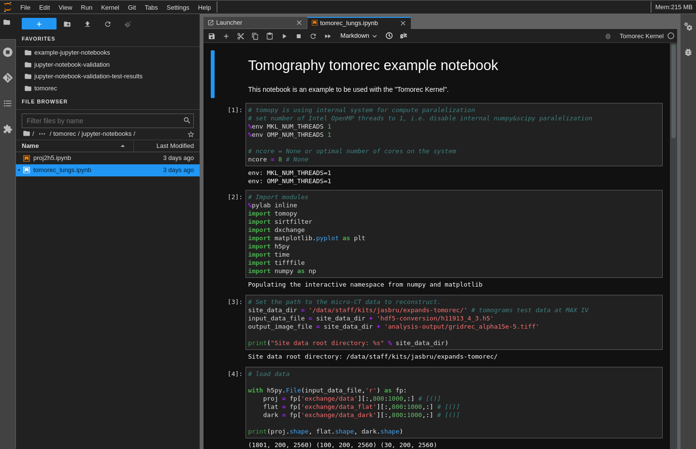
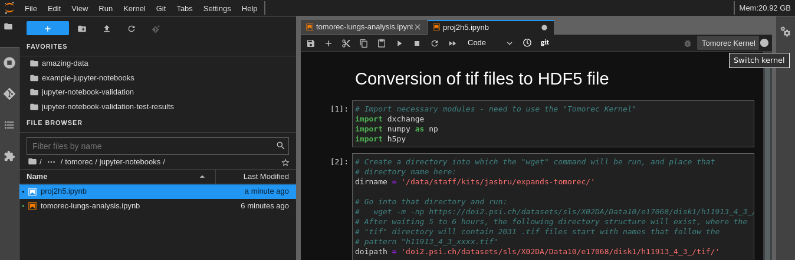

# TOMOREC

This README contains various recipes for installing a Tomorec Jupyter kernel,
downloading publically available data, and executing a sample analysis
Juptyer notebook.

The recipes described here are:
1. Creation of Tomorec kernel using an existing JupyterHub installation
2. Creation of a docker image locally which contains JupyterLab and a Tomorec
   kernel, which can then be run on ones own computer




# CLONE THIS REPOSITORY
With any of the recipes used, one must first clone this repository into either:
* Into a running JuptyerLab session on a JupyterHub service if you have access
  to one
* Or on to you own computer in a terminal if you do not have access to a
  JuptyerHub service or want to run it locally

Cloning command:
```bash
git clone https://github.com/jasonbrudvik/tomorec.git --branch tomorec-kernel-creeation
```

If in a JupyterLab session, open a terminal from the uppper left hand menu
"File > New > Terminal", navigate to a place where you want to keep this
repository, and then execute the above git command.


# CREATE TOMOREC KERNEL

If you already have a JupyterHub instance running into which you can
install your own kernel, then here is a recipe for creating a Tomorec kernel
in which you can run the Tomorec notebook included in this repository.

1. Open a terminal in your JuptyerLab session (File > New > Terminal) and go
   into the Tomorec repository that you have cloned:
```bash
cd tomorec/
```

2. Create the Tomorec conda environment:
```bash
conda env create --file jupyter-kernel/tomorec-kernel-environment.yml \
    --prefix ~/.conda/envs/tomorec-kernel-environment
```

3. After conda environment creation step is done, check that your conda
   environment exists with:
```bash
conda env list
```

   The environment should appear in your list of available environments,
   similar to:
```bash
tomorec-kernel-environment   /home/jasbru/.conda/envs/tomorec-kernel-environment
```

4. Create the Tomorec Jupyter kernel:
```bash
source activate tomorec-kernel-environment
python -m ipykernel install --user --name tomorec-kernel --display-name "Tomorec Kernel"
conda deactivate
```

5. The kernel creation step should finish quickly, then check that the kernel
   specification files exist:
```bash
jupyter kernelspec list
```

Among the kernels available, you should see something like this:
```bash
tomorec-kernel /home/jasbru/.local/share/jupyter/kernels/tomorec-kernel
```

It may take a couple minutes until the kernel is available in the "Launcher"
or from the kernel selection menu in notebooks.


# CREATE DOCKER IMAGE

If you do not have a JupyterHub instance available, then you can build
your own docker image which contains:
* JupyterLab
* Tomorec kernel
* Tomorec notebook

***TODO: Write This Section***


# GET TOMOREC DATA

## DOWNLOAD DATA
After you have a Tomorec kernel available (created via one of the two methods
mentioned above) you can download the data from:

[data doi url](https://doi.psi.ch/detail/10.16907/d699e1f7-e822-4396-8c64-34ed405f07b7)

Open a terminal (in the JupyterLab session if that is what you are using,
otherwise open locally), navigate to where you wish to store the data, and
then fetch the data with wget.

In this example, a directory is created on a shared storage server, and the
data is fetched into that directory:
```bash
mkdir /data/staff/kits/jasbru/expands-tomorec/
cd /data/staff/kits/jasbru/expands-tomorec/
wget -m -np https://doi2.psi.ch/datasets/sls/X02DA/Data10/e17068/disk1/h11913_4_3_/tif
```

This download will take some time as the total size is about 16 GB and there
are more than 2000 files.  In a recent attempt it took ~6 hours -  though
connection speeds will vary. If the connection is interrupted, repeat the
command and only missing files will be downloaded.


## CONVERT DATA TO HDF5
The downloaded data will be in .tif images files.  These will need to be
converted to the HDF5 file format in order to be used in the included Tomorec
analysis notebook.

First create an output folder into which the resulting HDF5 file will be
placed, for this example, it's done here:
```bash
cd /data/staff/kits/jasbru/expands-tomorec/
mkdir hdf5-conversion
```

In the JupyterLab file browser, navigate to where you have cloned this
repository and double click on the notebook for converting the .tif files to a
single HDF5 file included in this repository:
```bash
jupyter-notebooks/proj2h5.ipynb
```



Click on the "Switch Kernel" button in the upper right hand corner of the
notebook, and select the "Tomorec Kernel" in the menu that appears.


Change the following directory names to match what you have:
```bash
dirname = '/data/staff/kits/jasbru/expands-tomorec/'
foutname = dirname + 'hdf5-conversion/h11913_4_3.h5'
```

The other two path name variables can most likely be left as they are:
```bash
doipath = 'doi2.psi.ch/datasets/sls/X02DA/Data10/e17068/disk1/h11913_4_3_/tif/'
fname = dirname + doipath + 'h11913_4_3_'
```

From the upper left hand menu, select "Run > Run All Cells" and then scroll
through the notebook as the code in all of the cells are executed
automatically.


It should take less than 10 minutes to complete, and in the end you should have
an HDF5 file that's around 15 GB:
```bash
/data/staff/kits/jasbru/expands-tomorec/hdf5-conversion/
└── h11913_4_3.h5
```
Ignore any warnings concerning depreceated numpy syntax.


# RUN ANALYSIS NOTEBOOK
In the JupyterLab file browser, navigate to where you have cloned this
repository and double click on the notebook:
```bash
jupyter-notebooks/tomorec_lungs.ipynb
```

You will need to edit the notebook so that the correct locations of the
data file and final output image are used, for example:
```bash
site_data_dir = '/data/staff/kits/jasbru/expands-tomorec/'
input_data_file = site_data_dir + 'hdf5-conversion/h11913_4_3.h5'
output_image_file = site_data_dir + 'analysis-output/gridrec_alpha15e-5.tiff'
```

As done previously with the proj2h5.ipynb notebook, select the "Tomorec Kernel"
and then "Run > Run All Cells."  The analysis currently requires a large
amount of memory, if it is too much for the computer you are using, the
analysis will fail.

If everything went well, after 5 to 10 minnutes (depending on computing
resources available) you will see a figure in the end that looks like this:


This final figure will be saved as a tiff file in the specifed location, which
in the above example was:
```bash
/data/staff/kits/jasbru/expands-tomorec/
└── analysis-output/gridrec_alpha15e-5.tiff
```

Your results may be compared with the original running of this data analysis
here:
[github - tomorec_lung.ipynb](https://github.com/tomograms/tomography-notebooks/blob/master/tomorec_lungs.ipynb)
