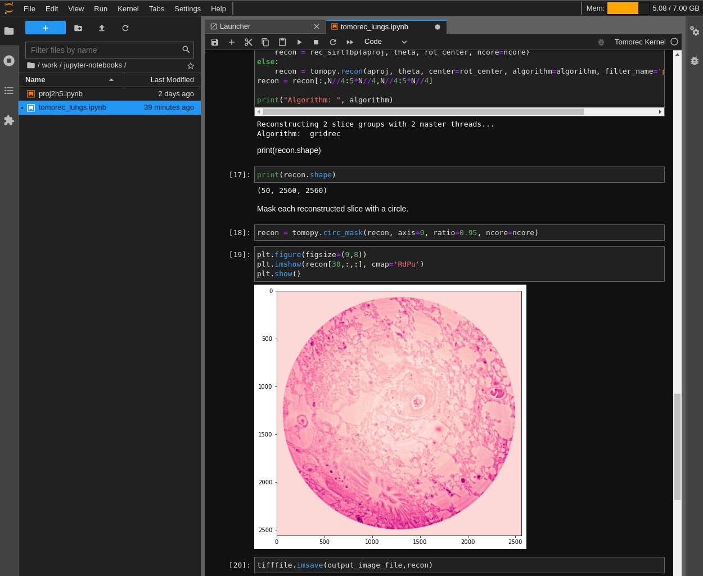

# TOMOREC ANALYSIS OVERVIEW

This README contains various recipes for installing a Tomorec Jupyter kernel,
downloading publically available data, and executing a sample analysis
Juptyer notebook.

This can be done with using either a JuptyerHub service, or it can be done
locally by building a docker image that contains JupyterLab and run on your
local machine.

The documentation below consists of several sections:
- [1 - CLONE THIS REPOSITORY](#1---clone-this-repository)
- [2 - DOWNLOAD DATA](#2---download-data)
- [3 - CREATE TOMOREC KERNEL](#3---create-tomorec-kernel)
- [3.1 - CREATE TOMOREC KERNEL IN JUPYTERLAB SESSION](#31---create-tomorec-kernel-in-jupyterlab-session)
- [3.2 - CREATE TOMOREC KERNEL AND DOCKER IMAGE](#32---create-tomorec-kernel-and-docker-image)
- [3.2.1 - INSTALL DOCKER](#321---install-docker)
- [3.2.2 - BUILD DOCKER IMAGE](#322---build-docker-image)
- [3.2.3 - RUN JUPYTERLAB LOCALLY](#323---run-jupyterlab-locally)
- [4 - CONVERT DATA TO HDF5](#4---convert-data-to-hdf5)
- [5 - RUN ANALYSIS NOTEBOOK](#5---run-analysis-notebook)


# 1 - CLONE THIS REPOSITORY
If you have access to a JupyterHub service, open a terminal from the uppper
left hand menu "File > New > Terminal".

If you do not have access to a JupyterHub service, no problem, you can do
this locally on your own computer. Open a local terminal.

In the terminal, navigate to a place where you want to keep this repository,
and then execute the repository cloning command:
```bash
git clone https://github.com/paulscherrerinstitute/tomorec.git
```


# 2 - DOWNLOAD DATA
The next item to download is the data. This is taken from the public
repository:

[data doi url](https://doi.psi.ch/detail/10.16907/d699e1f7-e822-4396-8c64-34ed405f07b7)

Still using
The simplest is probably to download the data into the data/ folder that exists
already in thís repository, as the included Juptyer notebooks are by default
setup to use that folder:
```bash
cd tomorec/data/
wget -m -np https://doi2.psi.ch/datasets/sls/X02DA/Data10/e17068/disk1/h11913_4_3_/tif
```

This download will take some time as the total size is about 16 GB and there
are more than 2000 files.  In a recent attempt it took about 50 minutes -
though connection speeds will vary. If the connection is interrupted, repeat
the command and only missing files will be downloaded.


# 3 - CREATE TOMOREC KERNEL
There are two ways to accomplish the creation of the Tomorec analsysis kerel:
* Either create it using conda in a running JuptyerLab session
* Or build a docker iamge that contains JupyterLab and the Tomorec kernel
  and run this locally.


## 3.1 - CREATE TOMOREC KERNEL IN JUPYTERLAB SESSION
If you already have a JupyterHub instance running into which you can
install your own kernel, then here is a recipe for creating a Tomorec kernel
in which you can run the Tomorec notebook included in this repository.

If not, then go to the next section titled
***CREATE TOMOREC KERNEL AND DOCKER IMAGE***


1. Open a terminal in your JuptyerLab session (File > New > Terminal) and go
   into the Tomorec repository that you have cloned:
```bash
cd tomorec/
```

2. Create the Tomorec conda environment:
```bash
conda env create --file jupyter-kernel/tomorec-kernel-environment.yml \
    --prefix ~/.conda/envs/tomorec-kernel-environment
```

3. After conda environment creation step is done, check that your conda
   environment exists with:
```bash
conda env list
```

   The environment should appear in your list of available environments,
   similar to:
```bash
tomorec-kernel-environment   /home/jasbru/.conda/envs/tomorec-kernel-environment
```

4. Create the Tomorec Jupyter kernel:
```bash
source activate tomorec-kernel-environment
python -m ipykernel install --user --name tomorec-kernel --display-name "Tomorec Kernel"
conda deactivate
```

5. The kernel creation step should finish quickly, then check that the kernel
   specification files exist:
```bash
jupyter kernelspec list
```

Among the kernels available, you should see something like this:
```bash
tomorec-kernel /home/jasbru/.local/share/jupyter/kernels/tomorec-kernel
```

It may take a couple minutes until the kernel is available in the "Launcher"
or from the kernel selection menu in notebooks.


## 3.2 - CREATE TOMOREC KERNEL AND DOCKER IMAGE

If you do not have a JupyterHub instance available, and you enjoy using
docker, then you can build your own docker image which contains:
* JupyterLab
* Tomorec kernel
* Tomorec notebook
Then you will be able to run JupyterLab on your laptop.


### 3.2.1 - INSTALL DOCKER
Docker will be needed for this step, so install it if you need to:

[Get Docker](https://docs.docker.com/get-docker/)

Also, add yourself to the docker group, as described here:

[Manage Docker as a non-root user](https://docs.docker.com/engine/install/linux-postinstall/#manage-docker-as-a-non-root-user)


### 3.2.2 - BUILD DOCKER IMAGE
A makefile has been included in this repository inorder to simplify somewhat
the procedure for building the Tomorec docker image.

The images here are based on the official
[Juptyer Docker Images](https://github.com/jupyter/docker-stacks), and have
been modified slightly so that when saving files within a running docker
container, the files will be saved on to your laptop will have the correct
permissions.

First, build the base-notebook image:
```bash
make build-base-notebook
```

And then build the tomorec-notebook, which is based upon the base-notebook that
you just created:
```bash
make build-tomorec-notebook
```

### 3.2.3 - RUN JUPYTERLAB LOCALLY
Now start the docker container with this image:
```bash
make run-tomorec-image
```

In the output in the terminal from running the above command you will see
a number of urls, like in this screenshot:


Copy that url and place into a web browser, then your JupyterLab session
should be visible:


# 4 - CONVERT DATA TO HDF5
The data you downloaded in an earlier step will be .tif images files.  These
will need to be converted to the HDF5 file format in order to be used in the
included Tomorec analysis notebook.

In the JupyterLab file browser (either running via JuptyerHub or your own
docker image), navigate to where you have cloned this repository and double
click on the notebook for converting the .tif files to a single HDF5 file
included in this repository:
```bash
jupyter-notebooks/proj2h5.ipynb
```


Click on the "Switch Kernel" button in the upper right hand corner of the
notebook, and select the "Tomorec Kernel" in the menu that appears.


Change the following directory names to match what you have, or leave them
as they are if you downloaded the data into the data/ direcotry in this
repository:
```bash
dirname = '../data/'
foutname = dirname + 'hdf5-conversion/h11913_4_3.h5'
```

The other two path name variables can most likely be left as they are:
```bash
doipath = 'doi2.psi.ch/datasets/sls/X02DA/Data10/e17068/disk1/h11913_4_3_/tif/'
fname = dirname + doipath + 'h11913_4_3_'
```

From the upper left hand menu, select "Run > Run All Cells" and then scroll
through the notebook as the code in all of the cells are executed
automatically.


It should take less than 10 minutes to complete, and in the end you should have
an HDF5 file that's around 15 GB:
```bash
tomorec/data/hdf5-conversion/
└── h11913_4_3.h5
```
Ignore any warnings concerning depreceated numpy syntax.


# 5 - RUN ANALYSIS NOTEBOOK
In the JupyterLab file browser, navigate to where you have cloned this
repository and double click on the notebook:
```bash
jupyter-notebooks/tomorec_lungs.ipynb
```

You will need to edit the notebook so that the correct locations of the
data file and final output image are used, for example:
```bash
site_data_dir = '../data/'
input_data_file = site_data_dir + 'hdf5-conversion/h11913_4_3.h5'
output_image_file = site_data_dir + 'analysis-output/gridrec_alpha15e-5.tiff'
```

As done previously with the proj2h5.ipynb notebook, select the "Tomorec Kernel"
and then "Run > Run All Cells."  The analysis currently requires a large
amount of memory, if it is too much for the computer you are using, the
analysis will fail.

If everything went well, after 5 to 10 minnutes (depending on computing
resources available) you will see a figure in the end that looks like this:



This final figure will be saved as a tiff file in the specifed location, which
in the above example was:
```bash
tomorec/data/
└── analysis-output/gridrec_alpha15e-5.tiff
```

Your results may be compared with the original running of this data analysis
here:
[github - tomorec_lung.ipynb](https://github.com/tomograms/tomography-notebooks/blob/master/tomorec_lungs.ipynb)
